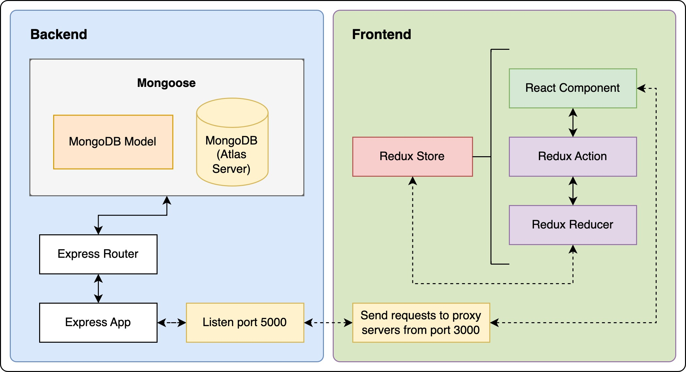

# MERN To-Do List App with JWT Authentication and Redux

## Overview

This project utilises the MERN stack to implement a todo list app. Redux is leveraged for state management and JSON Web Tokens (JWT) are used for user authentication.

## Installation and Setup Instructions

Clone the repository and run:

```
npm i
```

This will install all the project dependencies.

## Running the App

### 1. Start the server

```
cd backend
npm start
```

Note: for development purposes, running `npm server` will start the server with nodemon, which automatically restarts the server when the code is updated.

### 2. Run the client

```
cd frontend
npm start
```

## Design



Client runs on port 3000.

Server runs on port 5000.

The MongoDB instance is running in the cloud (Atlas DB).

### Client Side:

Components exist for the Item Modal, Navigation Bar and Todo List.
In addition to these, we have dedicated components for the authentication workflow, which include Login and Registration modals, and a Logout component.

We have defined actions for authentication, error handling, and item related functions. We also have corresponding reducers to handle the actions for these.

Redux is responsible for maintaining the app state. When an user invokes something on the UI which will change the app's state, a redux action is fired which is then handled by a corresponding redux reducer. The reducer then returns the updated state.

### Server Side:

Routes define the endpoints for adding users and items. It also defines the authentication endpoints.

Middleware is used for authentication.

Models contain the Mongoose/Mongo schemas.

### Redux

Efficiently handling and sharing state in an application is a difficult task, expecially when the application is large and multiple states have to be maintained for multiple components. This is where Redux comes in.

Redux is a state management library which will store and manage the applications states. Redux provides useful APIs which can be used to make changes to the existing state and also fetch the current state of the application.

To make a change in the application, we need to dispatch an action, which describes what changes we want to make in the state. These actions are then consumed by reducers, whose sole job is to accept two things - the action and the current state of the application - and return a new updated instance of the state. It is important to note that reducers do not change the state, but rather produce a new instance of the state with all the necessary updates.

### JSON Web Tokens

JWT provides a mechanism to authenticate users and requests. When an user is registered, it is assigned a java web token. An encrypted version of the token is stored in the database. When an user makes a request, first the user jwt is retrieved, decrypted and appended to the request header. On the backend, the token is verified, and the decoded token is added to the request, after which the remainder of the calling method is carried out.
If the token is missing or is invalid, then a error response is returned.

## Further Reading - Core Redux Principles

### The Redux Store

The global state of an application is stored in an object tree within a single store – Redux docs.

The Redux store is the main, central bucket which stores all the states of an application. It should be considered and maintained as a single source of truth for the state of the application.

If the store is provided to the App.js (by wrapping the App component within the <Provider> </Provider> tag) as can be found in /frontend/src/App.js, then all its children (children components of App.js) can also access the state of the application from the store. This makes it act as a global state.

### Redux Actions

The only way to change the state is to emit an action, which is an object describing what happened – Redux Docs

Since state in Redux is read-only, it assists in restricting any part of the view or any network calls to write/update the state directly.

Instead, if anyone wants to change the state of the application, then they'll need to express their intention of doing so by emitting or dispatching an action.

For example, if an user wants to add an item to the list, then they will have to click on the "Add Item" button and complete the form.

When the form is submitted, an action will be dispatched. This action is only a JS object describing what changes need to be done in the store.

For example, below is a code snippet from frontend/actions/itemActions.js.

```
// 1. addItem called from submit button in ItemModal.
// 2. addItem posts new item to backend i.e. updates mongoDB.
// 3. response from post is the item itself (see routes/api/items).
// 4. then, dispatch 'ADD_ITEM' call to reducer to add the data to state.
export const addItem = (item) => (dispatch, getState) => {
  axios
    .post("/api/items", item, tokenConfig(getState))
    .then((res) =>
      dispatch({
        type: ADD_ITEM,
        payload: res.data,
      })
    )
    .catch((err) =>
      dispatch(returnErrors(err.response.data, err.response.status))
    );
  return {
    type: ADD_ITEM,
    payload: item,
  };
};
```

The addItem action is linked to the submit button of the frontend/src/components/ItemModel.js form.

```
function onSubmit(e) {
  e.preventDefault();
  const newItem = {
    name: name,
  };
  props.addItem(newItem);
  // Close the modal
  toggle();
}
```

Note how in the above example, we dispatch an action when submitting a form. More specifically, we dispatch something known as an action creator – that is, the function addItem(). This in turn returns an action which is a plain JS object describing the purpose of the action denoted by the type key along with any other data required for the state change i.e. the payload.

Every action must have at least a type associated with it. Any other detail that needs to be passed is optional and will depend on the type of action we dispatch.

For example, the above code snippet dispatches the following action (in frontend/src/actions/itemActions.js):

```
...
// Action that got created by the action creator addItem()
case ADD_ITEM:
    // action.payload = the new item object
    return {
        ...state,
        items: [action.payload, ...state.items]
    };
...
```

### Redux Reducers

To specify how the state tree is transformed by actions, we write pure reducers – Redux docs

Reducers, as the name suggests, take in two things: previous state and an action. Then they reduce it (i.e. return) to one entity: the new updated instance of state.

So reducers are basically pure JS functions which take in the previous state and an action and return the newly updated state.

There can either be one reducer if it is a simple app or multiple reducers taking care of different parts or slices of the global state in a bigger application, as is done in this app. Each reducer will handle the state of each entity of the app (e.g. the list, the user).

Whenever an action is dispatched, all the reducers are activated. Each reducer filters out the action using a switch statement switching on the action type. Whenever the switch statement matches with the action passed, the corresponding reducers take the necessary action to make the update and return a fresh new instance of the global state.

Reducer example (frontend/src/reducers/itemReducer.js):

```
import { GET_ITEMS, ADD_ITEM, DELETE_ITEM, ITEMS_LOADING } from '../actions/types';

// NOTE:
// It is important to pass an initial state as default to
// the state parameter to handle the case of calling
// the reducers for the first time when the
// state might be undefined

const initialState = {
    items: [],
    loading: false
}

export default function (state = initialState, action) {
    switch(action.type) {
        case GET_ITEMS:
            // once items are added to state, set the 'loading' state to false
            return {
                ...state,
                items: action.payload,
                loading: false
            };
        case ADD_ITEM:
            // action.payload = the new item object
            return {
                ...state,
                items: [action.payload, ...state.items]
            };
...
        default:
            // Important to handle the default behaviour
            // either by returning the whole state as it is
            // or by performing any required logic
            return state
    }
}
```

In the above code snippet, we created a reducer called cartReducer which is a pure JS function. This function accepts two parameters: state and action.

Note that the state parameter is a default parameter which accepts an initial state. This is to handle the scenario when the reducer is called for the first time when the state value is undefined.

Also note that every reducer should handle the default case where, if none of the switch cases match with the passed action, then the reducer should return state as it is or perform any required logic on it before passing the state.

Whenever we dispatch an action with a certain type, we need to make sure to have appropriate reducers to handle that action.

In the above example, on clicking the button, we had dispatched an action with an action creator called addItem(). This action creator has dispatched an action with the type ADD_ITEM.

Next, we have created a reducer called itemReducer which takes the state (with the default initial state) and the action as parameters. It switches on the action type, and then whichever case matches with the dispatched action type, it makes the necessary update and returns the fresh new version of the updated state.

Note here that state in redux is immutable. So, the reducers make a copy of the entire current state first, make the necessary changes, and then return a fresh new instance of the state – with all the necessary changes/ updates.

So in the above example, we first make a copy of the entire state using the spread operator ...state. Then we update the items array by adding the new object passed in the action.payload shown below, and then finally return the updated object.

## Redux Summary

- The global state of an application is stored in an object tree within a single store.
- The only way to change the state is to emit an action, which is an object describing what happened.
- To specify how the state tree is transformed by actions, we write pure reducers.
